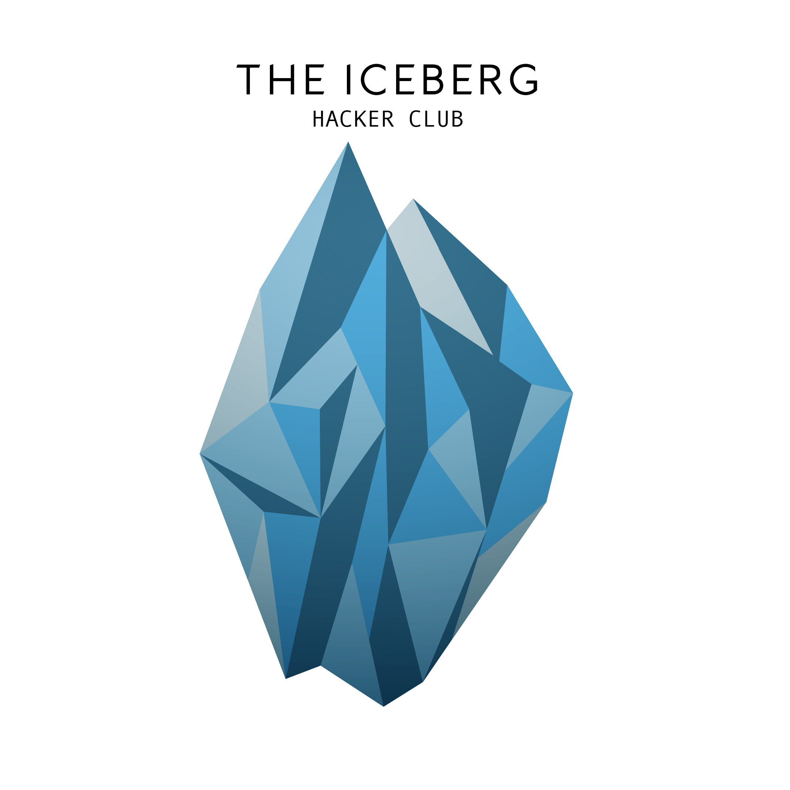

# Guidelines do The Iceberg hacker club

O objetivo principal deste hacker club é unir pessoas com a mesma paixão por desenvolvimento de software, buscando aproveitar essa união para adquirir novos aprendizados e experiências. Acreditamos que essa paixão por desenvolvimento vem muito próxima a uma grande vontade de aprender e a contribuir para comunidade como um todo.

### Objetivos do hacker club:

* Buscar novos aprendizados e experiências na área de desenvolvimento de sofware/hardware.
* Reunir os membros do HC todo mês (pode mudar) para desenvolver algum projeto escolhido pelo grupo. A proposta é que possamos discutir sobre diversas idéias previamente em nosso fórum (Ex: Aprender uma linguagem de programação ou framework; Criar um projeto que irá ajudar alguém) e então nos reunir para desenvolver em grupo com o foco principal em aprender.
* Criar um fórum para discutirmos sobre assuntos e artigos relacionados a tecnologia, organizar meetings para aprender algo novo, pedir ajuda sobre algum tópico e o que mais acharmos necessário.
* Utilizar o conhecimento dos membros para contribuir para projetos open source. Contribuir ativamente para comunidade open source é algo extramamente importante para manter a qualidade da comunidade de desenvolvedores, porém realizar essa tarefa sozinho pode ser muitas vezes desafiadora. Então quebraremos essa barreira buscando contribuir como um grupo :)
* Organizar e contribuir para eventos sobre tecnologia, ajudando com espaço para receber os eventos, contribuição com talks, brindes, coffe break e tudo que for ao nosso alcance para que seja um evento muito legal!
* Compartilhar recursos entre os membros e se possível para comunidade, Ex: E-books, tutoriais, videos, scripts, etc.
* Disponibilizar todos os projetos feitos no HC como open source nesse github, para que possamos contribuir para comunidade e encorajar outras iniciativas como esta.
* Criar um blog onde possamos compartilhar com o mundo nossos aprendizados e experiências.
* Manter uma cultura de respeito e amizade entre os membros do hc e a comunidade, mesmo que tenhamos como objetivos principais o aprendizado e a contribuição, buscaremos sempre nos divertir o máximo possível :)

### Não temos como objetivos do hacker club:

* Discutir sobre qual a melhor ferramenta pessoal de desenvolvimento (Ex: Emacs, Vim, Tmux, Mac, Linux, Atom, etc). Acreditamos que cada pessoa tem suas preferências e motivos para usar uma determinada ferramenta. Por isso, buscaremos sempre alternativas para não faltar respeito com algum membro.
* O famoso _blamework_, não iremos nos reunir para falar mal a respeito de alguma tecnologia, linguagem de programação ou framework.
* Não temos como objetivo criar nenhum projeto de iniciativa privada de código fechado ou que beneficie apenas uma organização/pessoa.
